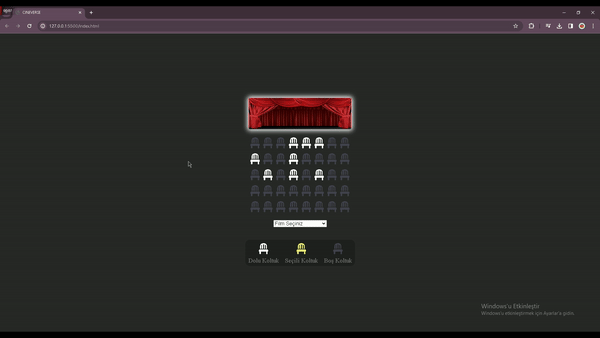

<h1>SİNEMA REZERVASYON SİTESİ</h1>

Yaptığım bu proje tasarım yanında işlevsellik de içermektedir. JavaScript teknolojisini sayesinde kullanıcılar izlemek istedikleri film için rezervasyon yapabilmektedir ancak bazı koltuklar maalesef daha önce rezerve edildi...

 
This project I made includes functionality as well as design. Thanks to JavaScript technology, users can make reservations for the movie they want to watch, but unfortunately the base seats are already reserved...

 
<h2>Özellikler</h2>

-Projede kullanıcıyı ilk olarak bir sinema perdesi karşılıyor. Bu sayede koltuk seçimi daha rahat olmaktadır.

-Perdenin altında ise sinema salonundaki koltukları simgeleyen koltuk emojileri bulunmakta. 

-Beyaz olan emojiler rezerve edilmiş anlamına gelmektedir. 

-Gri olanlar ise müsait koltuklar anlamına gelir. 

-Kullanıcı gri koltuklar arasında seçim yaptığında seçtiği koltuk sarı olmaktadır. 

-Eğer daha önce film seçilmediyse seçilen koltuk için fiyat bilgisi gösterilememekte olup "Lütfen Film Seçiniz" uyarısı çıkmaktadır.

-Film seçtikten sonra ise seçilen koltuk adedi ve fiyat bilgisi altta görünür.

-Seçtiğiniz koltuklardan vazgeçerseniz adet ve fiyat bilgisi ekrandan yok olur.

---

-The first thing that greets the user in the project is a cinema screen. In this way, seat selection is more comfortable.

-Under the curtain, there are seat emojis symbolizing the seats in the movie theater.

-White emojis mean reserved.

-The gray ones mean available seats. 

-When the user chooses between the gray seats, the selected seat is yellow. 

-If the movie has not been selected before, the price information for the selected seat cannot be displayed and the warning "Please Select Movie" appears.

-After selecting a movie, the number of seats selected and the price information appears at the bottom.

-If you give up the seats you have selected, the quantity and price information disappears from the screen.

<h2>Kullanılan Teknolojiler</h2>

HTML: Projenin ana yapısını oluşturmak için kullanılmıştır.
CSS: Projeye görsellik katmak ve kullanıcı kolaylığı sağlamak için kullanılmıştır. 
JS: Proje amacına bu teknoloji sayesinde ulaşmaktadır. Koltuk seçmek, adet bilgisi görebilmek ve filme göre fiyat bilgisini görebilmek için kullanılmıştır.

---

HTML: Used to create the main structure of the project.
CSS: It was used to add visuality to the project and provide user-friendliness. 
JS: The project achieves its goal thanks to this technology. It was used to select seats, to see quantity information and to see price information for to the movie.
 
 

<h2>Projenin Önizlemesi</h2>

